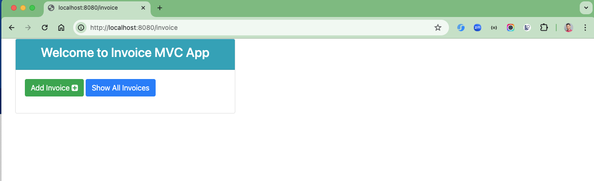
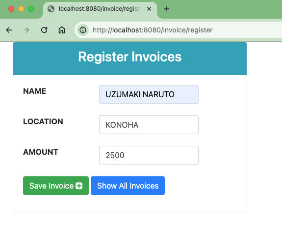
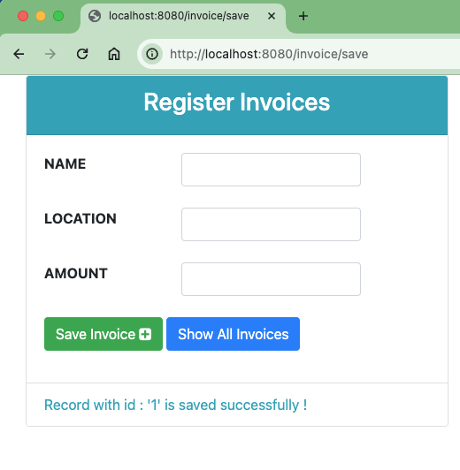
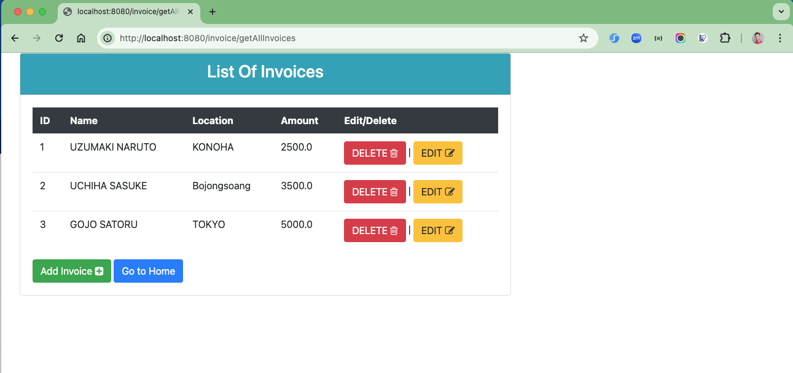
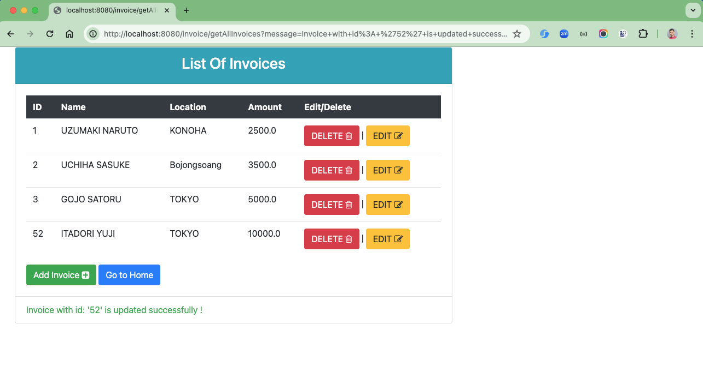
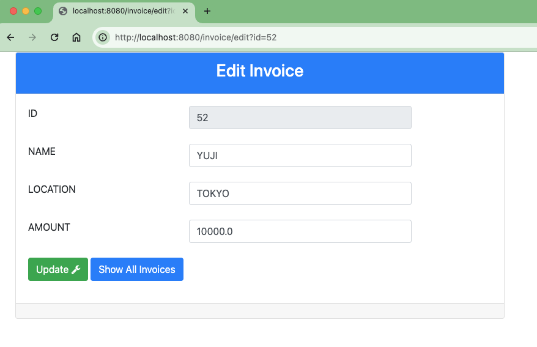

# spring-boot-invoice

### Things todo list

1. Clone this repository: `git clone https://github.com/hendisantika/spring-boot-invoice.git`
2. Navigate to the folder: `cd spring-boot-invoice`
3. Run the application: `mvn clean spring-boot:run`
4. Open your favorite browser: http://localhost:8080/invoice

### Image Screenshots

Home Page

Add New Invoice

List All invoices

Edit Invoice

